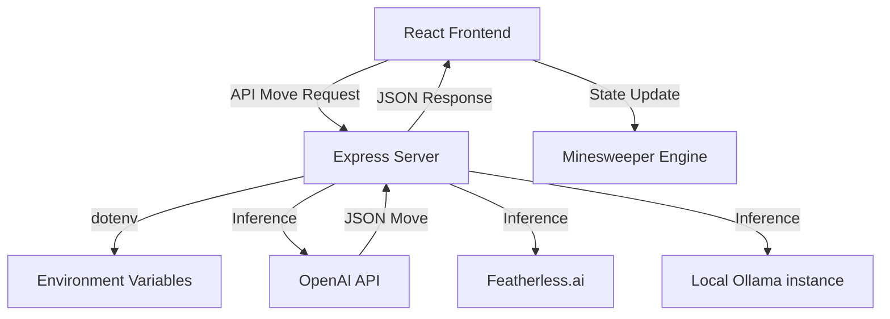

# Neural Sweeper: Tactical Minesweeper Arena

Neural Sweeper is a modern, tactical Minesweeper board where diverse AI personas compete to solve grids. Built with a "Tacticool" aesthetic, it leverages LLMs (OpenAI, Featherless.ai, and Ollama) to simulate human-like reasoning and decision-making in a classic puzzle environment.

https://github.com/user-attachments/assets/94399548-e7d0-463e-a961-763ba05b8de3


## Key Features

- **Persona-Driven AI Agents**: Choose from 4 unique personas (The Cautious Analyst, Pure Logic Engine, The Bold Gambler, and The Chaotic Glitch) each with distinct playstyles and prompt engineering.
- **Multi-Provider Support**:
  - **OpenAI**: Industry-standard high-performance inference.
  - **Featherless.ai**: High-speed, cost-effective alternative for OS models.
  - **Ollama**: Local-first inference for privacy-conscious users (auto-detects local models).
- **Tactical HUD**: A polished, cyber-punk inspired interface with real-time logs, neural trace monitoring, and confidence metrics.
- **Global Leaderboard**: Track the performance (Win/Loss) of different personas across sessions.

## Technology Stack

- **Frontend**: React 19, TypeScript, Tailwind CSS 4, Motion (Animations), Lucide Icons.
- **Backend Proxy**: Express.js (Node.js) to handle API key security and provider routing.
- **AI Integration**: OpenAI SDK (Compatible with Featherless and Ollama v1 endpoints).
- **Build System**: Vite.

## Architecture



## Getting Started

### Prerequisites

- Node.js (v20+)
- NPM or Yarn

### Installation

1. Clone the repository:
   ```bash
   git clone https://github.com/harishkotra/neural-sweeper.git
   cd neural-sweeper
   ```
2. Install dependencies:
   ```bash
   npm install
   ```
3. Set up environment variables in `.env`:
   ```env
   OPENAI_API_KEY=your_key
   FEATHERLESS_API_KEY=your_key
   OLLAMA_BASE_URL=http://localhost:11434
   ```
4. Run the development server:
   ```bash
   npm run dev
   ```

## How to Contribute

We welcome contributions! Here are some ideas for new features:

- **Persona Editor**: Allow users to create their own personas with custom system prompts.
- **Head-to-Head Mode**: Two AI agents solving the same board simultaneously from different corners.
- **Visual Thinking**: Show a "heatmap" of where the AI is considering moving next.
- **Chain of Thought**: Display the full internal reasoning ladder before the move is finalized.
